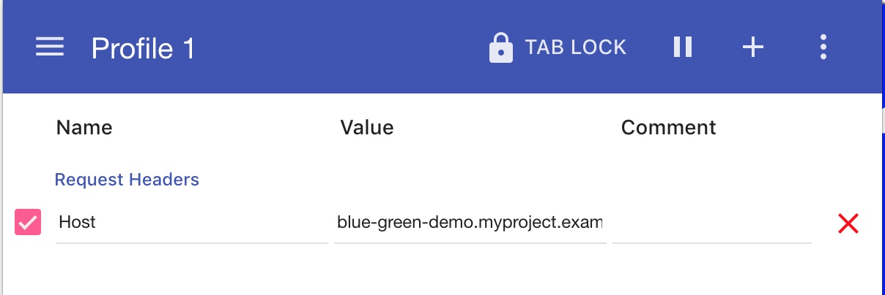
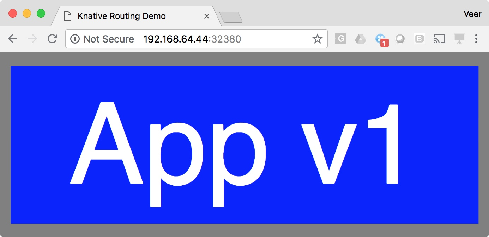
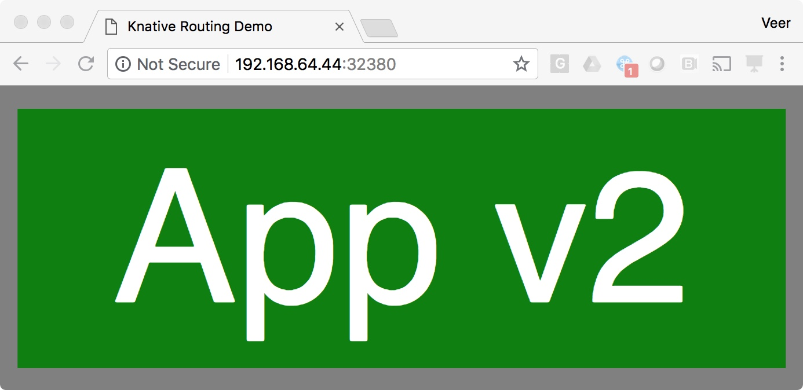

## Bluegreen Deployment

In this example, we will see how Knative can be used for Bluegreen Deployments.


### Deploy Blue version of the application

Let us first deploy blue version, with the `configuration` shown below.

```
$ cat bluegreen/blue-config.yaml 
apiVersion: serving.knative.dev/v1alpha1
kind: Configuration
metadata:
  name: blue-green-demo
  namespace: myproject 
spec:
  revisionTemplate:
    metadata:
      labels:
        knative.dev/type: container
    spec:
      container:
        image: gcr.io/knative-samples/knative-route-demo:blue # The URL to the sample app docker image
        imagePullPolicy: Always
        env:
          - name: T_VERSION
            value: "blue"
```

Create the configuration

```
$ kubectl apply -f bluegreen/blue-config.yaml 
configuration.serving.knative.dev/blue-green-demo created
```

This creates a `configuration` and `revision` but no `route` or `service`. **Remember** `service.serving.knative.dev` is the all encompassing object. It creates a kubernetes service though of `type=NodePort`.

```
$ kubectl get configuration -n myproject
NAME              CREATED AT
blue-green-demo   35s

$ kubectl get revision -n myproject
NAME                    CREATED AT
blue-green-demo-00001   44s

$ kubectl get route -n myproject
No resources found.

$ kubectl get pod -n myproject
NAME                                                READY     STATUS    RESTARTS   AGE
blue-green-demo-00001-deployment-7577dfb9fd-htdtt   2/2       Running   0          5m

$ kubectl get service -n myproject
NAME                            TYPE       CLUSTER-IP     EXTERNAL-IP   PORT(S)        AGE
blue-green-demo-00001-service   NodePort   10.111.68.64   <none>        80:31856/TCP   2m

$ kubectl get service.serving.knative.dev -n myproject
No resources found.
```

You'll also note that the `blue-green-demo-00001-deployment-xxxx-xxx` pod, runs initially, and goes down in about 5m when the corresponding autoscaler pod in `knative-serving` project is scaled down to 0.


Describe `revision` and you will notice the value of environment variable passed to the image is `blue` as we desired in the configuration.

```
$ kubectl describe revision -n myproject
...
...
  Container:
    Env:
      Name:             T_VERSION
      Value:            blue
    Image:              gcr.io/knative-samples/knative-route-demo:blue
    Image Pull Policy:  Always
...
...
```

### Create a Route 

Let us first create a route that directs all traffic to Blue version. See the route definition

```
$ cat bluegreen/route1.yaml 
apiVersion: serving.knative.dev/v1alpha1
kind: Route
metadata:
  name: blue-green-demo # The name of our route; appears in the URL to access the app
  namespace: myproject # The namespace we're working in; also appears in the URL to access the app
spec:
  traffic:
  - revisionName: blue-green-demo-00001
    percent: 100 # All traffic going to the first revision
```

Create the route

```
$ kubectl apply -f bluegreen/route1.yaml 
route.serving.knative.dev/blue-green-demo created
```

```
$ kubectl describe route blue-green-demo -n myproject
...
...
Spec:
  Generation:  1
  Traffic:
    Percent:        100
    Revision Name:  blue-green-demo-00001
Status:
  Conditions:
  ...
  ...
  Domain:                  blue-green-demo.myproject.example.com
  Domain Internal:         blue-green-demo.myproject.svc.cluster.local
  Traffic:
    Configuration Name:  blue-green-demo
    Percent:             100
    Revision Name:       blue-green-demo-00001
...
...

```

### Access the application

Determine the Host Name and IP Address to call

```
$ export IP_ADDRESS=$(minikube ip):$(kubectl get svc knative-ingressgateway -n istio-system -o 'jsonpath={.spec.ports[?(@.port==80)].nodePort}')

$ export URL=$(kubectl get route blue-green-demo -n myproject -o jsonpath={.status.domain})

$ echo $URL
blue-green-demo.myproject.example.com
```

Call the service. This will take a minute or so to bring the pod up.

```
$ curl -H "Host: ${URL}" http://${IP_ADDRESS}
<!DOCTYPE html>
<html lang="en">
<head>
    <title>Knative Routing Demo</title>
    <link rel="stylesheet" type="text/css" href="/css/app.css" />
</head>
<body>
        
            <div class="blue">App v1</div>
        
    </div>
</body>
</html>

```

To view the same output from Chrome browser by applying Header Extension to view the output as below:

**Applying Host to Header**



**Output**



### Deploy Green Version

Next we will deploy green version of configuration.

```
$ cat bluegreen/green-config.yaml 
apiVersion: serving.knative.dev/v1alpha1
kind: Configuration
metadata:
  name: blue-green-demo # Configuration name is unchanged, since we're updating an existing Configuration
  namespace: myproject 
spec:
  revisionTemplate:
    metadata:
      labels:
        knative.dev/type: container
    spec:
      container:
        image: gcr.io/knative-samples/knative-route-demo:green # URL to the new version of the sample app docker image
        imagePullPolicy: Always
        env:
          - name: T_VERSION
            value: "green" # Updated value for the T_VERSION environment variable          
```

```
$ kubectl apply -f bluegreen/green-config.yaml 
configuration.serving.knative.dev/blue-green-demo configured
```

This creates a new `revision` for the blue-green-demo configuration

```
$ kubectl get revision -n myproject
NAME                    CREATED AT
blue-green-demo-00001   2h
blue-green-demo-00002   30s
```

Check the revision description, you'll see that the value of environment variable is set to green as expected.

```
$ kubectl describe revision blue-green-demo-00002 -n myproject
...
...
Spec:
  Concurrency Model:  Multi
  Container:
    Env:
      Name:             T_VERSION
      Value:            green
    Image:              gcr.io/knative-samples/knative-route-demo:green
    Image Pull Policy:  Always
 ...
 ...

```

You'll also observe a pod for this revision running. This pod will terminate in a couple of minutes as there is no workload

```
$ kubectl get po -n myproject
NAME                                               READY     STATUS    RESTARTS   AGE
blue-green-demo-00002-deployment-75686d88f-klpjq   2/2       Running   0          2m
```


If you access the application at this point, it will still invoke the blue version pod and will show blue output. This is because the route is still pointing to the blue version.

```
$ curl -H "Host: ${URL}" http://${IP_ADDRESS}
<!DOCTYPE html>
<html lang="en">
<head>
    <title>Knative Routing Demo</title>
    <link rel="stylesheet" type="text/css" href="/css/app.css" />
</head>
<body>
        
            <div class="blue">App v1</div>
        
    </div>
</body>
</html>
```


### Update the Route

Let us apply the route as in the file below:

```
$ cat bluegreen/route2.yaml 
apiVersion: serving.knative.dev/v1alpha1
kind: Route
metadata:
  name: blue-green-demo # The name of our route; appears in the URL to access the app
  namespace: myproject # The namespace we're working in; also appears in the URL to access the app
spec:
  traffic:
  - revisionName: blue-green-demo-00001
    percent: 100 # All traffic still going to the first revision
  - revisionName: blue-green-demo-00002
    percent: 0 # 0% of traffic routed to the second revision
    name: v2 # A named route
```
 
 **Note** that the above route has an entry for `revisionName: blue-green-demo-00002`. However, **0%** traffic is flowing there. Also note the name parameter that has a value **v2**. 
 
Let us apply this route to update the existing route, as the name of the route is still `blue-green-demo`.

```
$ kubectl apply -f bluegreen/route2.yaml 
route.serving.knative.dev/blue-green-demo configured
```

Describe the route now to observe the following:

* Spec refers to both revisions, but still passing 100% traffic to the first revision
* Status section also shows the same. But since there is an additional route with name `v2`, we will be able to access the green revision using `v2.blue-green-demo.myproject.example.com` 

```
$ kubectl describe route -n myproject
...
...
Spec:
  Generation:  2
  Traffic:
    Percent:        100
    Revision Name:  blue-green-demo-00001
    Name:           v2
    Percent:        0
    Revision Name:  blue-green-demo-00002
Status:
....
....
  Domain:                  blue-green-demo.myproject.example.com
  Domain Internal:         blue-green-demo.myproject.svc.cluster.local
  Traffic:
    Configuration Name:  blue-green-demo
    Percent:             100
    Revision Name:       blue-green-demo-00001
    Configuration Name:  blue-green-demo
    Name:                v2
    Percent:             0
    Revision Name:       blue-green-demo-00002

```

Let us access the `green` revision from browser by setting the Request Header parameter `Host: v2.blue-green-demo.myproject.example.com`. This is the private url available to test the latest version of the application internally. 



However, if you access the public hostname `blue-green-demo.myproject.example.com` you should continue to see `blue` revision. Let us run it a few times. 
**Note** It will take a minute or so for the pod to come up. If you don't get any output try again.

```
$ for i in {1..20}; do curl -H "Host: blue-green-demo.myproject.example.com" http://$IP_ADDRESS --silent|grep App; done
            <div class="blue">App v1</div>
            <div class="blue">App v1</div>
            <div class="blue">App v1</div>
            <div class="blue">App v1</div>
            <div class="blue">App v1</div>
            <div class="blue">App v1</div>
            <div class="blue">App v1</div>
            <div class="blue">App v1</div>
            <div class="blue">App v1</div>
            <div class="blue">App v1</div>
            <div class="blue">App v1</div>
            <div class="blue">App v1</div>
            <div class="blue">App v1</div>
            <div class="blue">App v1</div>
            <div class="blue">App v1</div>
            <div class="blue">App v1</div>
            <div class="blue">App v1</div>
            <div class="blue">App v1</div>
            <div class="blue">App v1</div>
            <div class="blue">App v1</div>
```

Also note that there are two autoscalers in the `knative-serving` project, one for each revision

```
$ kubectl get rs -n knative-serving
NAME                                          DESIRED   CURRENT   READY     AGE
activator-847cf57479                          1         1         1         8h
blue-green-demo-00001-autoscaler-7c8b8c744    0         0         0         3h
blue-green-demo-00002-autoscaler-76d9b74c88   1         1         1         37m
controller-5d7f46bfd6                         1         1         1         8h
webhook-7f8ddf4499                            1       
```

### Split traffic between revisions

Let us update the route this time to share the traffic between two revisions by using the following route.

```
$ cat bluegreen/route3.yaml 
apiVersion: serving.knative.dev/v1alpha1
kind: Route
metadata:
  name: blue-green-demo # The name of our route; appears in the URL to access the app
  namespace: myproject # The namespace we're working in; also appears in the URL to access the app
spec:
  traffic:
  - revisionName: blue-green-demo-00001
    percent: 50 # Updating the percentage from 100 to 50
  - revisionName: blue-green-demo-00002
    percent: 50 # Updating the percentage from 0 to 50
    name: v2

```

Apply this route

```
$ kubectl apply -f bluegreen/route3.yaml 
route.serving.knative.dev/blue-green-demo configured
```

Confirm that the traffic is shared 50% between revisions `blue-green-demo-00001` and `blue-green-demo-00002`

```
$ kubectl describe route blue-green-demo -n myproject
...
...
Spec:
  Generation:  3
  Traffic:
    Percent:        50
    Revision Name:  blue-green-demo-00001
    Name:           v2
    Percent:        50
    Revision Name:  blue-green-demo-00002
Status:
...
...
  Domain:                  blue-green-demo.myproject.example.com
  Domain Internal:         blue-green-demo.myproject.svc.cluster.local
  Traffic:
    Configuration Name:  blue-green-demo
    Percent:             50
    Revision Name:       blue-green-demo-00001
    Configuration Name:  blue-green-demo
    Name:                v2
    Percent:             50
    Revision Name:       blue-green-demo-00002
```

Test the application again. You'll notice that the traffic is all going to `green` version, if you ran this quickly after the above change. But this is because the `green` pod was already deployed and running when applied the above change. It takes a little while for the `blue` pod to come up. 

So first test may look like this.
```
$ for i in {1..20}; do curl -H "Host: blue-green-demo.myproject.example.com" http://$IP_ADDRESS --silent|grep App; done
            <div class="green">App v2</div>
            <div class="green">App v2</div>
            <div class="green">App v2</div>
            <div class="green">App v2</div>
            <div class="green">App v2</div>
            <div class="green">App v2</div>
            <div class="green">App v2</div>
            <div class="green">App v2</div>
            <div class="green">App v2</div>
            <div class="green">App v2</div>
            <div class="green">App v2</div>
            <div class="green">App v2</div>
            <div class="green">App v2</div>
            <div class="green">App v2</div>
            <div class="green">App v2</div>
            <div class="green">App v2</div>
            <div class="green">App v2</div>
            <div class="green">App v2</div>
            <div class="green">App v2</div>
            <div class="green">App v2</div>
```

But test it again in a minute or two and you'll see the following approximate 50% split of traffic between `blue` and `green` revisions.

```
$ for i in {1..20}; do curl -H "Host: blue-green-demo.myproject.example.com" http://$IP_ADDRESS --silent|grep App; done
            <div class="green">App v2</div>
            <div class="blue">App v1</div>
            <div class="blue">App v1</div>
            <div class="blue">App v1</div>
            <div class="green">App v2</div>
            <div class="blue">App v1</div>
            <div class="blue">App v1</div>
            <div class="green">App v2</div>
            <div class="blue">App v1</div>
            <div class="blue">App v1</div>
            <div class="blue">App v1</div>
            <div class="green">App v2</div>
            <div class="green">App v2</div>
            <div class="blue">App v1</div>
            <div class="blue">App v1</div>
            <div class="green">App v2</div>
            <div class="blue">App v1</div>
            <div class="blue">App v1</div>
            <div class="blue">App v1</div>
            <div class="green">App v2</div>
```

### Moving all traffic to new revision

Although obvious, let us move all traffic to `green` revision by using the following route. With this update we are naming to the first revision as `v1` in case anyone wants to test it with the internal url `v1.blue-green-demo.myproject.example.com`

```
$ cat bluegreen/route4.yaml 
apiVersion: serving.knative.dev/v1alpha1
kind: Route
metadata:
  name: blue-green-demo # The name of our route; appears in the URL to access the app
  namespace: myproject # The namespace we're working in; also appears in the URL to access the app
spec:
  traffic:
  - revisionName: blue-green-demo-00001
    percent: 0
    name: v1 # Adding a new named route for v1
  - revisionName: blue-green-demo-00002
    percent: 100
    # Named route for v2 has been removed, since we don't need it anymore
```

```
$ kubectl apply -f bluegreen/route4.yaml 
route.serving.knative.dev/blue-green-demo configured
```

And observe that all traffic goes to the `green` revision.

```
$ for i in {1..20}; do curl -H "Host: blue-green-demo.myproject.example.com" http://$IP_ADDRESS --silent|grep App; done
            <div class="green">App v2</div>
            <div class="green">App v2</div>
            <div class="green">App v2</div>
            <div class="green">App v2</div>
            <div class="green">App v2</div>
            <div class="green">App v2</div>
            <div class="green">App v2</div>
            <div class="green">App v2</div>
            <div class="green">App v2</div>
            <div class="green">App v2</div>
            <div class="green">App v2</div>
            <div class="green">App v2</div>
            <div class="green">App v2</div>
            <div class="green">App v2</div>
            <div class="green">App v2</div>
            <div class="green">App v2</div>
            <div class="green">App v2</div>
            <div class="green">App v2</div>
            <div class="green">App v2</div>
            <div class="green">App v2</div>

```

  
### Clean up

Using following steps you can clean up your `myproject` namespace and get ready for the next exercise.

```
$ kubectl delete -f bluegreen/blue-config.yaml 
configuration.serving.knative.dev "blue-green-demo" deleted
```

```
$ kubectl delete -f bluegreen/route4.yaml 
route.serving.knative.dev "blue-green-demo" deleted
```
  
  


 
  


 
 