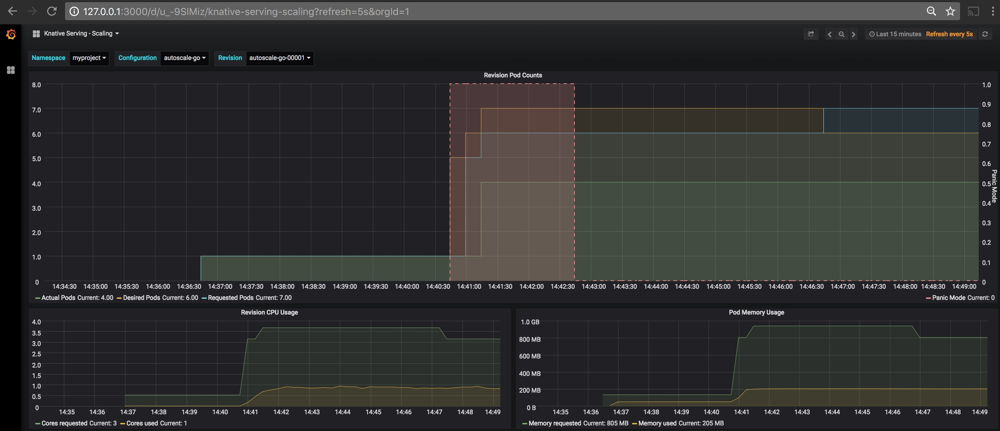

## Autoscaling

In this exercise we will test the autoscaling feature of Knative by pumping workload to the application. 

### Prerequisites
* You need a Knative running on Minishift or Minikube
* You need a load generation tool. This lab uses [Siege](https://www.joedog.org/siege-home/), an http load testing and benchmarking utility. Install a similar tool, if you don't already have one.
* If you don't want to create the yamls on your own, clone the repository so that you can use the samples provided.

### Deploy a Knative Service
We will first deploy a service with the following specification to test autoscaling. 

```
$ cat autoscaling/service.yaml 
# Copyright 2018 The Knative Authors
#
# Licensed under the Apache License, Version 2.0 (the "License");
# you may not use this file except in compliance with the License.
# You may obtain a copy of the License at
#
#     https://www.apache.org/licenses/LICENSE-2.0
#
# Unless required by applicable law or agreed to in writing, software
# distributed under the License is distributed on an "AS IS" BASIS,
# WITHOUT WARRANTIES OR CONDITIONS OF ANY KIND, either express or implied.
# See the License for the specific language governing permissions and
# limitations under the License.
apiVersion: serving.knative.dev/v1alpha1
kind: Service
metadata:
  name: autoscale-go
  namespace: myproject
spec:
  runLatest:
    configuration:
      revisionTemplate:
        spec:
          container:
            image: veermuchandi/autoscale-go
```

Deploy the service as shown below

```
$ kubectl apply -f autoscaling/service.yaml 
service.serving.knative.dev/autoscale-go created
```

This will start running a pod (that will eventually scale down to zero) in the namespace `myproject`

```
$ kubectl get po -n myproject
NAME                                             READY     STATUS    RESTARTS   AGE
autoscale-go-00001-deployment-57597d5d5b-9qs62   3/3       Running   0          30s
```

Deploying the service creates other Knative primitives i.e., configuration, revision and route.

```
$ kubectl get configuration.serving.knative.dev -n myproject
NAME           CREATED AT
autoscale-go   1m

$ kubectl get revision.serving.knative.dev -n myproject
NAME                 CREATED AT
autoscale-go-00001   1m

$ kubectl get route.serving.knative.dev -n myproject
NAME           CREATED AT
autoscale-go   1m

```

### Prepare for Autoscaling

Open a new tab from where you will generate workload.

Create environment variables that point to the Hostname of the service from the Knative route and the IPAddress and port where knative-ingressgateway is listening.

> For **Minikube**: When looking up the IP address to use for accessing your app, you need to look up the NodePort for the knative-ingressgateway as well as the IP address used for Minikube

```
$ export IP_ADDRESS=$(minikube ip):$(kubectl get svc knative-ingressgateway -n istio-system -o 'jsonpath={.spec.ports[?(@.port==80)].nodePort}')
```

> For **Minishift**: Since we are using NodePort approach with minishift, you will find the IPAddress of the node and the NodePort for the knative-ingressgateway

```
$ export IP_ADDRESS=$(oc get node -o 'jsonpath={.items[0].status.addresses[0].address}'):$(oc get svc knative-ingressgateway -n istio-system -o 'jsonpath={.spec.ports[?(@.port==80)].nodePort}')
```


```
$ export URL=$(kubectl get route.serving.knative.dev autoscale-go -n myproject -o jsonpath={.status.domain})

$ echo $URL
autoscale-go.myproject.example.com
```

Test the application using curl once. The response will be delayed as it has to spin up a new pod.

```
$ curl -H "Host: ${URL}" "http://${IP_ADDRESS}?sleep=100&prime=1000000&bloat=50"
Allocated 50 Mb of memory.
The largest prime less than 1000000 is 999983.
Slept for 100.27 milliseconds.
```

You'll notice that a pod is running.

```
$ kubectl get po -n myproject
NAME                                             READY     STATUS    RESTARTS   AGE
autoscale-go-00001-deployment-57597d5d5b-vzzps   3/3       Running   0          43s
```

### Test Autoscaling

Setting up URLs for Siege: Create a file to be used as input for Siege as shown below.

```
$ cat autoscaling/urls.txt
http://${IP_ADDRESS}?sleep=100&prime=1000000&bloat=50"
```

Generate the load by running Siege.

```
$ siege -H "Host: ${URL}" -f autoscaling/urls.txt
```
This will continuously generate a good amount of load.

Open another tab and watch the pods in myproject. You'll notice that very soon the number of pods will go up.

```
$ watch kubectl get po -n myproject                                                                                            

NAME                                             READY     STATUS    RESTARTS   AGE
autoscale-go-00001-deployment-57597d5d5b-b4vhm   3/3       Running   0          23s
autoscale-go-00001-deployment-57597d5d5b-cbtwx   0/3       Pending   0          5s
autoscale-go-00001-deployment-57597d5d5b-cz8sl   3/3       Running   0          22s
autoscale-go-00001-deployment-57597d5d5b-grx79   3/3       Running   0          4m
autoscale-go-00001-deployment-57597d5d5b-qm75n   3/3       Running   0          23s
autoscale-go-00001-deployment-57597d5d5b-r4q57   0/3       Pending   0          21s
autoscale-go-00001-deployment-57597d5d5b-ssdm4   0/3       Pending   0          13s
```

### Monitoring using Grafana

Open another tab to port-forward grafana monitoring console to localhost.

```
$ kubectl port-forward -n monitoring $(kubectl get pods -n monitoring --selector=app=grafana --output=jsonpath="{.items..metadata.name}") 3000
Forwarding from 127.0.0.1:3000 -> 3000
Forwarding from [::1]:3000 -> 3000
```

Now you can access Grafana at `http://127.0.0.1:3000/`, and using **Knative Serving-Scaling** view to look at .



### Clean Up

```
$ kubectl delete -f autoscaling/service.yaml 
service.serving.knative.dev "autoscale-go" deleted
```


If you are running on minishift, as of now, you'll have to delete all the objects yourself to clean up the project by running the following:

```
oc project myproject
kubectl delete service.serving.knative.dev --all
kubectl delete configuration.serving.knative.dev --all
kubectl delete revision.serving.knative.dev --all
kubectl delete route.serving.knative.dev --all
kubectl delete builds.build.knative.dev --all
kubectl delete service --all
kubectl delete deployments --all
kubectl delete rs --all
kubectl delete po --all
kubectl delete deployment $(kubectl get deployments -n knative-serving | grep autoscaler | awk '{print $1}') -n knative-serving
kubectl delete rs $(kubectl get rs -n knative-serving | grep autoscaler | awk '{print $1}') -n knative-serving
kubectl delete po $(kubectl get po -n knative-serving | grep autoscaler | awk '{print $1}') -n knative-serving  
  
```	


